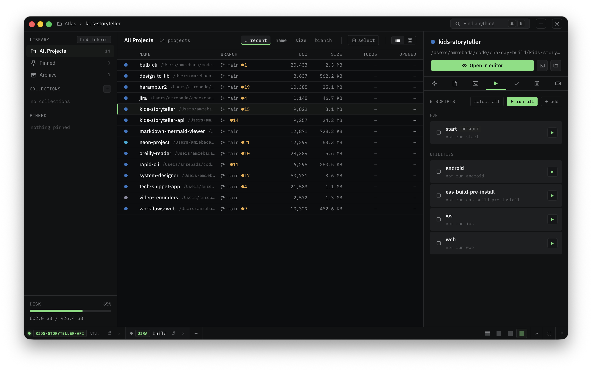

<div align="center">


# Atlas

[](https://github.com/amrebada/atlas/actions/workflows/ci.yml)
[](https://github.com/amrebada/atlas/releases)




</div>

A desktop-native command hub for local git projects. Atlas indexes every repository under
your chosen watch roots, surfaces live git status, and gives you one place to open editors,
run scripts, manage terminals, capture notes, and track todos per project.

Built with Tauri 2 (Rust) + React 19 + TypeScript + SQLite.

## Features

- **Three-pane workspace**: sidebar with collections / pinned / tags, dense project list with
  sort pills and virtualized scrolling, and a per-project inspector (Overview, Files, Sessions,
  Scripts, Todos, Notes, Disk).
- **Live git status** for every indexed repo: branch, dirty count, ahead/behind, author.
  Commit, stash, and push straight from the Files tab.
- **Multi-pane terminal strip** backed by real PTYs. Opens shells, runs scripts, and resumes
  Claude Code sessions in tabs / split / grid layouts. Panes persist across project switches so
  you can monitor long-running work across the whole workspace. Each pane has kill and rerun
  controls.
- **Scripts**: auto-discovers `package.json`, `Makefile`, and `Taskfile.yml` entries. Also
  supports user-defined per-project scripts.
- **Notes**: rich-text Tiptap editor with a slash menu, stored as HTML under the project's
  `.atlas/` directory so they travel with the repo.
- **Todos and tags**: per-project todos with an FTS-backed palette search; tag filter chips in
  the sidebar with a capped 3-row layout and an overflow menu.
- **Multi-select bulk actions**: pin / unpin, add tag, add to or remove from collection,
  archive, move to trash — applied to any set of selected projects.
- **Command palette** (`⌘K`): fuzzy search across projects, notes, and actions.
- **Folder watchers**: `notify-rs`-driven, debounced. New repos appear as soon as they
  materialize under a watched root.
- **Menu-bar tray** (macOS): quick access to recent projects from the system menu bar.
- **Performance**: designed to stay under 180 MB RSS idle with 50 projects watched; list
  virtualization keeps the grid at 60 fps past 1000 rows.

## Storage model

Per-project JSON files under `<project>/.atlas/` are the source of truth (portable, diffable,
git-friendly). A SQLite index at `~/Library/Application Support/atlas/atlas.db` caches
searchable fields for cross-project queries; it rebuilds itself from the JSON on mismatch.

## Keyboard

| Shortcut   | Action                              |
|------------|-------------------------------------|
| `⌘K`       | Command palette                     |
| `⌘N`       | New project                         |
| `⌘⇧N`      | Clone from URL                      |
| `⌘,`       | Settings                            |
| `⌘E`       | Open selected project in editor     |
| `⌃` `` ` `` | Open terminal                      |
| `⌃⌘F`      | Maximize terminal strip             |
| `⇧⌘A`      | Multi-select                        |
| `⌘S`       | Save (notes)                        |
| `Esc`      | Close overlay / cancel              |
| `?`        | Keyboard cheat-sheet                |

## Install

Pre-built binaries for macOS, Linux, and Windows ship with every tagged release. See the
[Releases page](https://github.com/amrebada/atlas/releases). On macOS, the `.dmg` contains a
universal Apple Silicon + Intel bundle.

## Build from source

Prerequisites:

- Rust stable (1.78+)
- Node.js 20+ and [pnpm](https://pnpm.io/)
- Platform build deps for Tauri 2 — see [the Tauri setup guide](https://tauri.app/start/prerequisites/)

```bash
git clone https://github.com/amrebada/atlas.git
cd atlas
pnpm install
pnpm tauri dev        # dev build with hot reload
pnpm tauri build      # production bundle
```

The first Rust compile pulls in `libgit2`, `sqlite`, and the Tauri runtime; budget 5-10
minutes on a fresh checkout. Subsequent builds are incremental.

## Project layout

```
src-tauri/         Rust core (Tauri commands, watchers, PTY manager, git, SQLite)
  src/commands/    IPC command handlers
  src/storage/     SQLite + JSON hybrid store
  src/watcher/     notify-rs pipeline
  src/terminal/    portable-pty pane manager
  migrations/      SQLite schema migrations
src/               React frontend
  components/      Shared UI primitives
  features/        Feature slices (palette, notes, scripts, terminal, ...)
  hooks/           React hooks (IPC subscriptions, shortcuts)
  ipc/             Typed Rust command wrappers
  state/           Zustand stores
  types/           Shared Rust/TS types
```

## Contributing

Bug reports, feature requests, and pull requests are welcome. See [CONTRIBUTING.md](./CONTRIBUTING.md)
for development setup, coding style, and the PR process.

## License

MIT. See [LICENSE](./LICENSE).

Authored by Amr Ebada.
